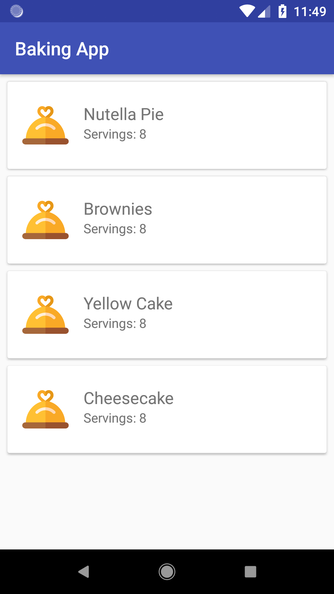
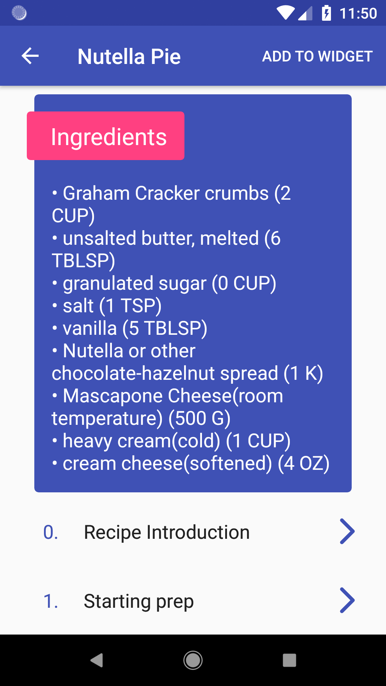
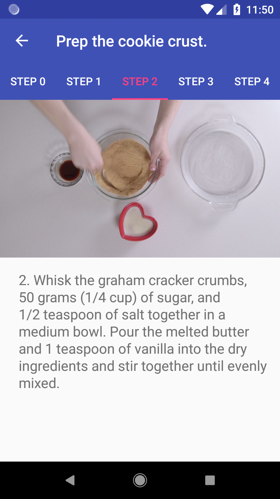
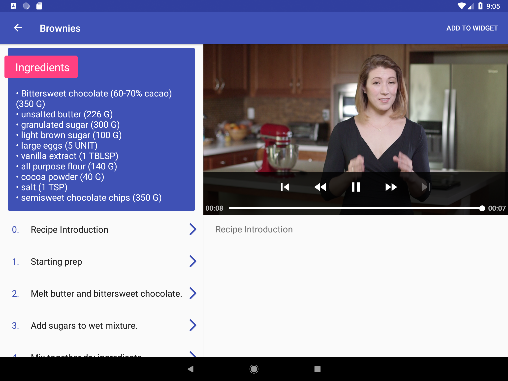

# BakingApp

An Android Baking App that will allow Udacity’s resident baker-in-chief, 
Miriam, to share her recipes with the world. You will create an app that will allow a user to 
select a recipe and see video-guided steps for how to complete it.

# Project Overview
You will productionize an app, taking it from a functional state to a production-ready state. 
This will involve finding and handling error cases, adding accessibility features, allowing for 
localization, adding a widget, and adding a library.

# Screenshots

         

# Why this Project?
As a working Android developer, you often have to create and implement apps where you are 
responsible for designing and planning the steps you need to take to create a production-ready app. 
Unlike Popular Movies where we gave you an implementation guide, it will be up to you to figure things 
out for the Baking App.

# What Will I Learn?
In this project you will:

- Use MediaPlayer/Exoplayer to display videos.
- Handle error cases in Android.
- Add a widget to your app experience.
- Leverage a third-party library in your app.
- Use Fragments to create a responsive design that works on phones and tablets.

# Attributions
These were some helpful resources:

- https://www.youtube.com/watch?v=uCtzH0Rz5XU
- https://medium.com/google-developers/tasks-and-the-back-stack-dbb7c3b0f6d4
- https://android.jlelse.eu/android-dtt-13-how-to-set-recyclerviews-layoutmanager-in-xml-and-why-you-shouldn-t-350da048a801
- https://medium.com/@dbottillo/android-ui-test-espresso-matcher-for-imageview-1a28c832626f
- https://medium.com/@SimonKaz/android-testing-setting-sharedprefs-before-launching-an-activity-558730506b7c
- https://www.freepik.com/free-vectors/icons
- https://stackoverflow.com/
